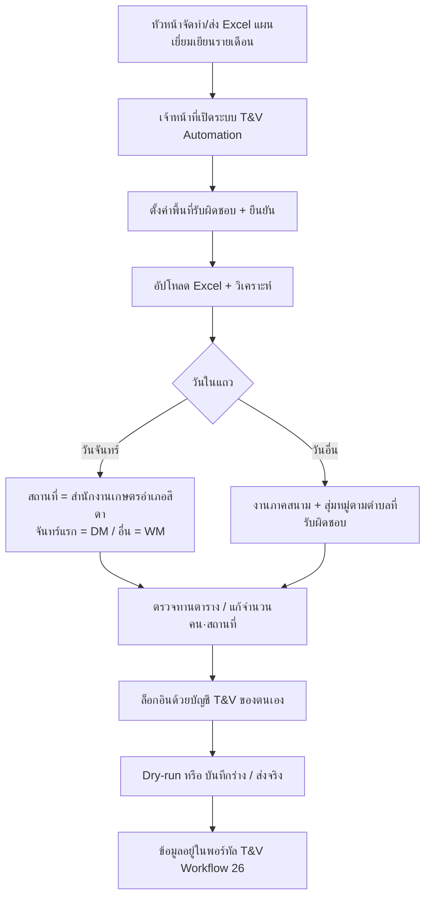

# กระแสงานรายเดือน: Excel แผนเยี่ยมเยียน → T&V

เอกสารนี้อธิบายลำดับงานที่สำนักงานเกษตรอำเภอ (โดยเฉพาะ **สีดา**) ใช้กับระบบ T&V Automation ทุกเดือน — จากไฟล์ที่หัวหน้าส่ง จนถึงข้อมูลในพอร์ทัล Workflow 26

ดูคู่มือหน้าจอทีละขั้นได้ที่ [USER_GUIDE.md](USER_GUIDE.md)

---

## ภาพรวมกระแสงาน



---

## บทบาทในกระแสงาน

| คน | ทำอะไรในเดือนนั้น |
|----|-------------------|
| **หัวหน้า / เกษตรอำเภอ** | จัดทำและส่งไฟล์ Excel แผนเยี่ยมเยียน · อาจใช้ระบบเองในบทบาทหัวหน้า (ทุกตำบล · ไม่สุ่มหมู่) |
| **เจ้าหน้าที่ประจำตำบล** | ตั้งค่าตำบลที่รับผิดชอบ (1 หรือหลายตำบล) → อัปโหลดแผน → ตรวจ → กรอกด้วยบัญชีตนเอง |
| **ธุรการ** | ใช้บทบาท «ไปกับหัวหน้า» = ทุกตำบล · ไม่สุ่มหมู่ · กรอกด้วยบัญชีตนเอง |

แต่ละคนใช้ **บัญชี T&V ของตนเอง** เสมอ

---

## ขั้นที่ A — ไฟล์ Excel ที่หัวหน้าส่ง

### ชื่อชีตแนะนำ

ชื่อแผ่นงานเป็นเดือนไทย + ปีย่อ เช่น `ส.ค.69`, `ก.ย.69`, `พ.ค.69`  
ระบบจะแสดงเฉพาะชีตที่ดูเหมือนชื่อเดือน

### คอลัมน์มาตรฐาน (ไฟล์ที่หัวหน้าส่ง — มีเครื่องมือ/สถานที่)

| ลำดับโดยทั่วไป | ชื่อคอลัมน์ | ระบบใช้ทำอะไร |
|----------------|-------------|----------------|
| 1 | สัปดาห์ที่ | อ้างอิง |
| 2 | **วัน เดือน ปี** | แปลงเป็นวันที่ พ.ศ. (รองรับช่วงวัน → หลายแถว) |
| 3 | **กิจกรรม/งานที่ปฏิบัติ** | จำแนกประเด็น/กิจกรรม T&V |
| 4 | เครื่องมือ / อุปกรณ์ / สื่อ | ช่วยจำแนกประเภท |
| 5 | สถานที่ | จัดใหม่ถ้าเป็น placeholder / ชื่อเครื่องมือ |
| 6 | **บุคคลเป้าหมาย** | คำนวณจำนวนคน (`PD_TARGET`) |
| 7 | ผู้ร่วมปฏิบัติ / เจ้าหน้าที่ | เก็บเป็นข้อมูลผู้ร่วม |
| 8 | หมายเหตุ | ข้อมูลเสริม |

รูปแบบย่อ (ไม่มีคอลัมน์เครื่องมือ) ที่หัวตารางมีแค่ `กิจกรรม` + `บุคคลเป้าหมาย` ก็อ่านได้เช่นกัน

### ตัวอย่างวันที่ในเซลล์

| ใน Excel | ผลหลังวิเคราะห์ |
|----------|-----------------|
| `๓ ส.ค. ๖๙` / `3 ส.ค.69` | 1 แถว: 03/08/2569 |
| `๕-๗ ส.ค. ๖๙` | 3 แถว: 05–07/08/2569 |
| `10 ส.ค. 69` | 1 แถว: 10/08/2569 |

### ตัวอย่างวันจันทร์ ส.ค. 2569 (ชีต `สค69`)

| วันที่ | ผล |
|--------|-----|
| 03/08/2569 | DM (13) ที่สำนักงาน |
| 10/17/24/31 ส.ค. | WM (14) ที่สำนักงาน |

### ตัวอย่างจำนวนคน

| บุคคลเป้าหมาย | จำนวนคน |
|----------------|---------|
| `เกษตรกร 15 ราย` | 15 |
| `จนท.` / `ทุกท่าน` | 7 |
| (ว่าง) | 0 — ยกเว้นแถวประชุมจันทร์ที่ระบบเติม 7 |

---

## ขั้นที่ B — ตั้งค่าพื้นที่รับผิดชอบ (ก่อนอัปโหลด)

ลำดับบังคับบนหน้าจอ:

1. พรีเซ็ต **อำเภอสีดา** (หรือเลือกจังหวัด/อำเภอเอง)
2. บทบาท: เจ้าหน้าที่ / หัวหน้า / ธุรการ
3. ติ๊กตำบลที่รับผิดชอบ (**หน่วยเล็กสุด = ตำบล** — ไม่เลือกหมู่ในขั้นนี้)
4. ชื่อสำนักงาน: `สำนักงานเกษตรอำเภอสีดา`
5. กด **ยืนยันพื้นที่รับผิดชอบ**

จนกว่าจะยืนยัน ปุ่มวิเคราะห์ Excel จะยังกดไม่ได้

### ผลต่อสถานที่งานภาคสนาม

| การตั้งค่า | หลังวิเคราะห์ Excel (งานภาคสนาม) |
|------------|-----------------------------------|
| 1 ตำบล | สุ่มหมู่ 2–4 จากหมู่จริงของตำบลนั้น |
| หลายตำบล (ไม่ครบอำเภอ) | สุ่มหมู่ทุกตำบลที่เลือก แล้วรวมใน `PD_PLACE` |
| ทุกตำบล (หัวหน้า/ธุรการ/ติ๊กครบ) | ใส่ทุกตำบล · ไม่สุ่มหมู่ |

---

## ขั้นที่ C — วิเคราะห์และจัดประเภทแถว

### C1 วันจันทร์ → ประชุมสำนักงานเท่านั้น

ระบบบังคับ (ทั้งฝั่งเซิร์ฟเวอร์และหน้าจอ):

| เงื่อนไข | รหัสกิจกรรม | ชื่อที่ใส่ในรายละเอียดโดยทั่วไป |
|----------|-------------|-------------------------------|
| จันทร์ และวันที่ ≤ 7 | **DM** (`13`) | ประชุมสำนักงานเกษตรอำเภอประจำเดือน (DM) |
| จันทร์ อื่น | **WM** (`14`) | ประชุมสำนักงานเกษตรอำเภอประจำสัปดาห์ (WM) |

**สถานที่:** `สำนักงานเกษตรอำเภอสีดา` เท่านั้น (ไม่มีหมู่/ตำบล)

### C2 วันอื่น → งานภาคสนาม

- จำแนกกิจกรรมจากชื่อในคอลัมน์กิจกรรม (เช่น วิสาหกิจชุมชน, ทะเบียนเกษตรกร, ศพก., อื่นๆ)
- จัดสถานที่ตามกฎสุ่มหมู่ด้านบน
- รูปแบบเป้าหมาย:

```
หมู่ 1, 3, 5 ตำบลหนองตาดใหญ่, หมู่ 2, 4 ตำบลสามเมือง
```

หมู่ถูกเลือกจากไฟล์ภูมิศาสตร์จริง เช่น หนองตาดใหญ่มีหมู่ 1–9 ไม่ใช่เลขสมมติ 1–20

### C3 ตัวเลือกบนหน้าจอ

ช่องกาเครื่องหมาย **「สุ่มหมู่/ตำบลในสถานที่ หลังวิเคราะห์ Excel」**

- เปิด (แนะนำ): ใช้กฎสุ่มด้านบน
- ปิด: ใส่เฉพาะชื่อตำบลที่รับผิดชอบ (ยังไม่สุ่มหมู่) — แก้ในตารางทีหลังได้

---

## ขั้นที่ D — ตรวจทานก่อนกรอก

Checklist รายเดือน:

- [ ] ชีตเดือนถูกต้อง (เช่น ส.ค.69)
- [ ] แถววันจันทร์ทุกแถวอยู่ที่สำนักงาน และเป็น DM/WM ถูกสัปดาห์
- [ ] งานภาคสนามมีหมู่ที่อยู่ในตำบลที่รับผิดชอบจริง
- [ ] จำนวนคนสอดคล้องกับบุคคลเป้าหมาย
- [ ] ไม่มีแถวหยุด/ลาหลุดเข้ามาโดยไม่ตั้งใจ (ตรวจจากกฎ rules-based และตรวจทานตารางก่อนรัน)

---

## ขั้นที่ E — กรอกลงพอร์ทัล T&V

### บัญชี

1. กรอก username + password **ของตนเอง**
2. ระบุผู้อนุมัติให้ตรงรายชื่อในพอร์ทัล
3. เลือกโหมด:
   - **Dry-run** ก่อนเสมอเมื่อเป็นเดือนใหม่ / ไฟล์ใหม่
   - **บันทึกชั่วคราว** เมื่ออยากเก็บร่าง
   - **บันทึก & ส่ง** เมื่อตรวจครบแล้ว

### สิ่งที่ระบบทำบนพอร์ทัล

1. เปิด `tandv.doae.go.th` แล้วล็อกอิน
2. เข้า Workflow 26
3. เลือกปี / เดือน / **ตำบล**
4. เพิ่มข้อมูลทีละแถว: ประเด็น · กิจกรรม · วันที่ · รายละเอียด · **PD_PLACE** · จำนวนเป้าหมาย
5. เลือกผู้อนุมัติ
6. บันทึกตามโหมด

**หัวหน้า / ธุรการ:** ระบบจัดกลุ่มแถวตามตำบล แล้ววนเปิด Workflow ทีละตำบล

**เจ้าหน้าที่หลายตำบลในสถานที่เดียวกัน:** ข้อความสถานที่อาจรวมหลายตำบลในแถวเดียว แต่การส่งขึ้นพอร์ทัลยังผูกกับตำบลที่เลือกในฟอร์ม Workflow (ดู log ว่าเปิดตำบลใด)

---

## ปฏิทินงานแนะนำ (รายเดือน)

| ช่วง | งาน |
|------|-----|
| ต้นเดือน (หลังได้ไฟล์จากหัวหน้า) | ตั้งค่าพื้นที่ · อัปโหลด · Dry-run |
| หลัง Dry-run ผ่าน | บันทึกร่าง หรือส่งจริงด้วยบัญชีตนเอง |
| กลาง–ปลายเดือน | แก้แถวที่พลาดด้วยมือบนพอร์ทัล หรือรันเฉพาะเดือนเดิมหลังแก้ Excel |
| เปลี่ยนเดือน | อัปโหลดชีตใหม่ · ตรวจกฎจันทร์ (DM ของเดือนนั้น) อีกครั้ง |

---

## จุดที่พบบ่อยว่าผิดพลาด

| อาการ | สาเหตุที่พบบ่อย | แก้ |
|-------|-----------------|-----|
| อัปโหลดไม่ได้ | ยังไม่ยืนยันพื้นที่ | กลับไป Step พื้นที่รับผิดชอบ |
| ไม่มีหมู่ในสถานที่ | โหมดทุกตำบล / ปิดสุ่ม / ไม่มีข้อมูลหมู่บ้าน | ตรวจบทบาทและตัวเลือกสุ่ม |
| เข้าสู่ระบบไม่สำเร็จ | รหัสผิด / ไม่ใช่บัญชีตนเอง | กรอกรหัสใหม่ใน session |
| ชื่อตำบลไม่ขึ้นใน T&V | สะกดไม่ตรงรายการพอร์ทัล | ใช้พรีเซ็ตสีดา / เลือกจากรายการในระบบ |
| หน้าจอไม่เปลี่ยนหลังอัปเดตโค้ด | แคชเบราว์เซอร์ | **Ctrl+F5** |

---

## ไฟล์และโมดูลที่เกี่ยวข้อง (สำหรับผู้ดูแลระบบ)

| ส่วน | ไฟล์ |
|------|------|
| อ่าน Excel แผนเยี่ยมเยียน + กฎจันทร์ | `app.py` (`load_visit_plan_records`, `apply_sida_office_meeting_rules`) |
| สุ่มหมู่ / รูปแบบ PD_PLACE / ล็อกอัปโหลด | `static/app.js` |
| หน้าจอ Step | `templates/index.html` |
| พรีเซ็ตสีดา | `config/districts.json` |
| หมู่บ้านจริงรายตำบล | `data/villages/{tambon_code}.json` · `geo_data.py` |

---

## เอกสารที่เกี่ยวข้อง

- [USER_GUIDE.md](USER_GUIDE.md) — คู่มือผู้ใช้ฉบับเต็ม
- [DEPLOY.md](DEPLOY.md) — ติดตั้งและข้อมูลภูมิศาสตร์
- [README.md](../README.md) — ภาพรวมโปรเจกต์
